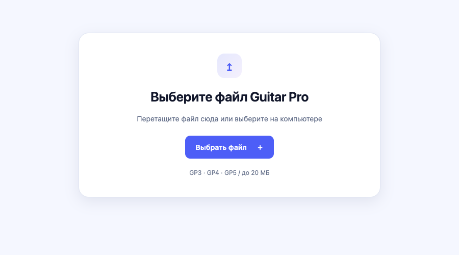
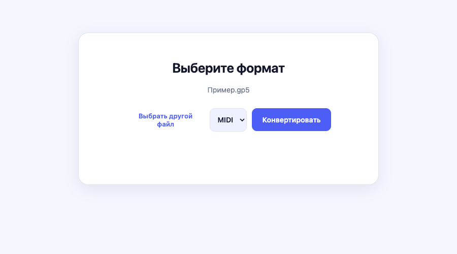

# Guitar Pro конвертер

Локальное приложение React + Electron для macOS и обычного браузера. Один исходник → один MIDI со всеми партиями в одной общей дорожке либо один стерео MP3 с общим миксом. Без аккаунта, редактора, сервера конвертации и ручных аудионастроек.

## Быстрый старт / Getting started

Требуются **Node.js 22.12+** и npm.

```sh
git clone https://github.com/AndreyGulevich/guitar-pro-converter.git
cd guitar-pro-converter
npm ci
npm run dev
```

Откройте адрес из терминала — обычно **http://127.0.0.1:5173/**. Если порт занят, Vite выберет следующий. Оставьте терминал работающим; `Ctrl+C` останавливает сервер.

Публичная публикация сайта отменена. Для работы используйте локальный запуск.

## Как пользоваться

1. Выберите или перетащите один файл `.gp3`, `.gp4` или `.gp5` размером до 20 МБ.
2. Выберите **MIDI** (одна общая дорожка, инструменты разделены каналами) или **MP3** (стереомикс). Для замены композиции нажмите «Выбрать другой файл».
3. Нажмите **«Конвертировать»** и дождитесь завершения. Выбор файла сам обработку не запускает; для MP3 отображается прогресс.
4. Нажмите **«Скачать MIDI»** или **«Скачать MP3»**. В браузере файл скачивается обычным способом, в Electron открывается диалог сохранения. **«Начать заново»** возвращает к выбору файла.

### Выбор файла



### Формат и конвертация



Скриншоты сняты с текущего приложения. «Пример.gp5» — демонстрационное имя для экрана выбора. Музыкальные данные и чужие композиции в скриншоты и репозиторий не включены.

## Другие способы запуска

```sh
npm run electron       # собрать интерфейс и запустить Electron
npm run build          # статическая браузерная сборка в dist/
npm run preview        # http://127.0.0.1:4173
npm run package        # .app для Apple Silicon в release/mac-arm64/
open "release/mac-arm64/Guitar Pro конвертер.app"
```

Команды запускаются отдельно. Для `preview` сначала выполните `build`.

Содержимое `dist/` можно разместить на обычном статическом HTTP(S)-сервере, в том числе в подкаталоге. Сервер должен отдавать `.js` как JavaScript. Открытие `index.html` через `file://` в обычном браузере не поддерживается. Electron открывает локальную сборку самостоятельно.

Собранная `.app` содержит интерфейс, кодировщик и звуковой банк. Она работает без сети. Браузер получает эти ресурсы с того же статического сервера; банк (~1,3 МБ) загружается при MP3-экспорте с отдельным сообщением. После закрытия страницы автономность браузерной версии не гарантируется: service worker не установлен. Музыкальные данные никуда не отправляются.

## Конвертация и ограничения

- alphaTab **1.8.4** читает сохранённые ноты, темп и его изменения, программы инструментов, громкость, панораму и поддерживаемые приёмы. Кириллические поля GP3–5 читаются в Windows-1251. Партитура не заменяется шаблоном настроек.
- MIDI: Standard MIDI File **format 0**, все партии в одной общей дорожке с сохранением каналов инструментов. Ударные остаются на MIDI-канале 10. Общий канал для нескольких барабанных партий допустим, но их контроллеры действуют совместно.
- В пользовательских GP обнаружены внутренние номера каналов 16, 26, 30. Запись такого номера в четырёхбитное поле MIDI приводит к совпадению с 0, 10, 14. Поэтому мелодическим партиям назначаются уникальные пары каналов (основной и для приёмов), без изменения нот и музыкальных настроек. Первая версия явно отклоняет больше **7 мелодических партий** плюс ударные; резервные каналы не схлопываются молча.
- MP3: локальный синтез alphaTab/SONiVOX → LAME, **стерео 44,1 кГц, 192 кбит/с**. Используется тот же score, все партии и исходная карта темпа. Никакого промежуточного действия с MIDI не требуется. Транспонирование применяется один раз, как в официальном audio-export API.
- Первый проход измеряет максимальную амплитуду, второй кодирует с общим коэффициентом усиления и потолком −6 dBFS для запаса после MP3-декодирования. Соотношение громкостей партий сохраняется. PCM обрабатывается небольшими блоками, целая песня не хранится в памяти как PCM.
- Лимиты: один файл до **20 МБ**, MP3 до **30 минут**, таймаут обработки MIDI 60 секунд / MP3 20 минут. Ошибки формата, повреждённого файла, банка и сохранения показываются в интерфейсе.
- Проверены предоставленные **GP 5.00** (4 файла) и **GP 4.06** (1 файл). GP3 и **GP 5.1/5.10** поддерживаются импортёром alphaTab (в исходниках есть ветки `version >= 510`), но реального пользовательского образца 5.10 не было — эта версия не проверена на таком файле. GP6/7/8 в первой версии не принимаются.
- Тембры MP3 определяются SONiVOX; MIDI звучит через банк вашего плеера. Идентичность Guitar Pro и передача всех эффектов не обещаются. RSE, плагины и записанные аудиодорожки не воспроизводятся. Некоторые приёмы передаются приближённо. Экспортёр alphaTab определяет окончание звука; хвосты эффектов могут отличаться от Guitar Pro.

## Архитектура и безопасность

После нажатия «Конвертировать» интерфейс передаёт байты файла в Web Worker. alphaTab разбирает партитуру; MIDI-экспортёр записывает её события, а MP3-экспортёр синтезирует звук и кодирует аудио. Результат возвращается в интерфейс для сохранения. Музыка обрабатывается на устройстве пользователя.

`src/converter.js` — импорт и MIDI, `src/audio.js` — синтез/MP3. Оба модуля независимы от React и Electron и запускаются также в Node.js. `src/worker.js` выполняет долгую операцию в Web Worker; React показывает результат и прогресс. Команда `converter` в сообщении нужна, чтобы встроенный listener alphaTab не считал сообщение своим.

Electron использует `contextIsolation`, sandbox и отключённый `nodeIntegration`. Preload предоставляет только сохранение MIDI/MP3. IPC проверяет отправителя, формат и размер данных. Путь выбирается системным диалогом; запись выполняется через временный файл и атомарное переименование. Переходы, новые окна и запросы разрешений заблокированы. В renderer нет доступа к файловой системе.

## Проверки

```sh
npm test                    # 5 локальных образцов + повреждённые/пустые/неверные данные
npm run build               # подготовить сборку перед UI-проверкой
npm run preview             # оставить работающим в отдельном терминале
npm run test:ui             # Chrome: 5 MIDI + 5 MP3, скачивание, декодирование и ошибки
npm run test:electron       # Electron: 5 MIDI + MP3, реальная запись через IPC
```

Исходники берутся из `~/Downloads`, либо задайте `GP_SAMPLES_DIR`. Нужны ровно эти имена: `01 Герои (н).gp5`, `02 - Сумеем помочь (midi).gp5`, `03 Меч судьбы (н).gp5`, `06 Время вышло (н).gp5`, `Карфаген.gp4`. Они не включены в репозиторий/сборку. `work/` с тестовыми экспортами игнорируется git.

UI-тест использует установленный Chrome (`CHROME_PATH` для другого пути), проверяет независимым MIDI parser структуру и браузерным MP3 decoder аудио. Для теста готовой `.app` задайте `APP_EXECUTABLE` к её `Contents/MacOS/Guitar Pro конвертер` и запустите `npm run test:electron`. Системный save-dialog подменяется только в тестовом процессе, настоящая проверка IPC и запись сохраняются.

Подробные результаты: `VALIDATION.md`. `npm audit` на момент сборки: 0 уязвимостей.

## Лицензии и распространение

См. `THIRD_PARTY_NOTICES.md`. alphaTab — MPL-2.0, банк SONiVOX — Apache-2.0 по лицензии поставки alphaTab, LAME/lamejs — LGPL-3.0, React — MIT. Копии уведомлений, LGPL/GPL и архив соответствующего исходного кода lamejs включены в `public/licenses/` и итоговые сборки. Encoder выносится в отдельный JS-модуль; проект и lockfile позволяют заменить библиотеку и пересобрать приложение.

Сборка предназначена для этого Mac (arm64). Подписи Developer ID и notarization нет: для передачи на другой Mac может потребоваться подписание либо системное подтверждение запуска. Для текущего локального запуска это не препятствие. Установщик DMG и автообновление не включены. Музыкальные исходники и результаты конвертации не входят в репозиторий.
